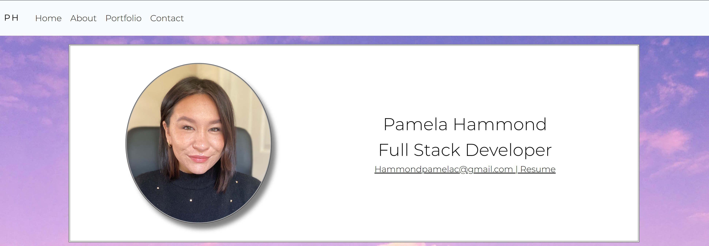

# Portfolio

This webpage is dedicated to all of my most valued work and is a reflection of my unique personality and talents. I styled the page using React.js. I included links to my social media accounts including Github and LinkedIn.

Please visit : https://pamtheham.github.io/Portfolio/

## Table of Contents

- [Description](#description)
- [Pictures of Application](#pictures-of-application)
- [Technologies](#technologies)
- [Credits](#credits)
- [Challenges](#challenges)
- [Contact Information](#contact-information)

## Technologies

&nbsp;
&nbsp;

&nbsp;
&nbsp;
&nbsp;
&nbsp;
&nbsp;
&nbsp;

## Credits

There were no other collaborators on this project, just me!

## Challenges

The biggest challenge of this project was determining how to design my portfolio to reflect my own personal style and aesthetic while at the same time displaying my skills in programming.

## Contact Information

If you have any questions about this project, please email me here: Hammondpamelac@gmail.com.

My GitHub username is: www.github.com/PamtheHam
